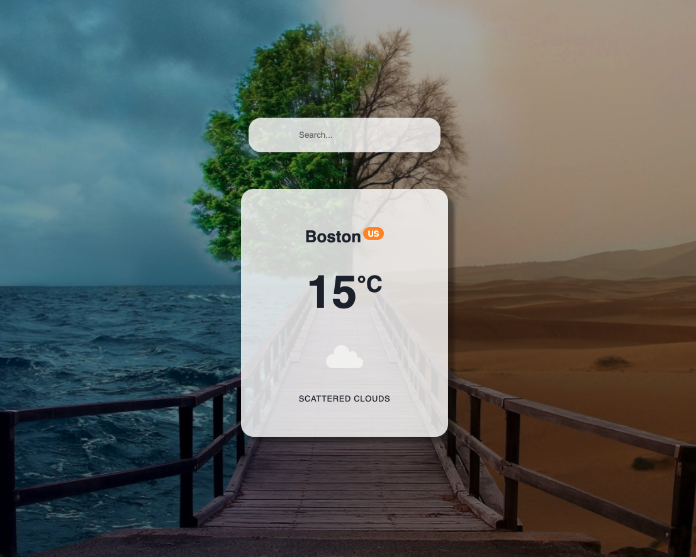

# pwa-weather-app

A weather app using the openweather API. This app is optimized as a Progressive Web App.



|                                         |                                         |                                                   |
| :-------------------------------------: | :-------------------------------------: | :-----------------------------------------------: |
|    [Introduction](#pwa-weather-app)     | [Table of Contents](#table-of-contents) | [Development Highlights](#development-highlights) |
|        [Deployment](#deployment)        |    [Page Directory](#page-directory)    |       [Code Hightlights](#code-highlights)        |
| [Technologies Used](#Technologies-Used) |           [Credits](#Credits)           |                [License](#License)                |

## Development Highlights

- Create service worker to cache pages, which provides offline functionality.
- Create manifest for the app.

## Deployment

This app is deployed on netlify.

[Deployment](https://wonderful-jang-eb58fd.netlify.app/)

## Page Directory

The service worker.js file is created in the public folder. The index.html has a script tag that registers the service worker. The manifest.json and images are also in the public folder. The offline.html file that is loaded during offline functionality is in the public folder too.

## Code Highlights

Creating the manfest.json.

```JavaScript
{
  "short_name": "Weather App",
  "name": "Weather App PWA",
  "icons": [
    {
      "src": "/images/logo.png",
      "type": "image/png",
      "sizes": "1024x1024"
    }
  ],
  "start_url": ".",
  "display": "standalone",
  "theme_color": "#000000",
  "background_color": "#ffffff"
}
```

The service worker is listening to the fetch event. The service worker will see if any of the caches matches it and will return the matched if there is. If there is none, it will return the offline.html because there is only one index.html file in react and the user must be offline.

```JavaScript
// listen for request
self.addEventListener('fetch', (event) => {
    event.respondWith(
        caches.match(event.request)
            .then(() => {
                return fetch(event.request)
                    .catch(() => caches.match('offline.html'))
            })
    )
})
```

## Technologies

- [react](https://reactjs.org/)
- [pwa](https://web.dev/progressive-web-apps/)

## Credits

The starter code was provided by 2U bootcamp.

|                           |                                                                                                                                                                                                       |
| ------------------------- | ----------------------------------------------------------------------------------------------------------------------------------------------------------------------------------------------------- |
| **David Anusontarangkul** | [ LinkedIn](https://www.linkedin.com/in/anusontarangkul/) [ GitHub](https://github.com/anusontarangkul) |

## License

[](https://opensource.org/licenses/MIT)
